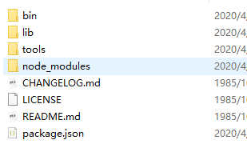

# 使用docsify 写开源文档

文档演示地址：

> docsify 是一个动态生成文档网站的工具。不同于 GitBook、Hexo 的地方是它不会生成将 `.md` 转成 `.html` 文件，所有转换工作都是在运行时进行。

搭建一个像下面这样的文档类型的网站，你可以用来当做项目的说明文档，也还可以当做自己专属的知识小仓库。

官网教程的也很详细了，地址：https://docsify.js.org/#/zh-cn/quickstart ，不过这篇教程比较贴合实际使用。

# 1、初始化项目

## 1.1 安装Node.js

- 下载地址：https://nodejs.org/dist/v8.9.4/node-v8.9.4-x64.msi
- 下载完成后点击安装。
- 查看node 版本，命令：node -v
  - 版本：v8.9.4

## 1.2 安装docsify-cli工具

命令行执行：

```shell
npm i docsify-cli -g
```

会在这个路径下

 C:\Users\Administrator\AppData\Roaming\npm\node_modules

生成 docsify-cli 文件夹



## 1.3 初始化文档结构

先创建有一个本地文件夹docs, 然后执行命令

```
docsify init ./docs
```

会生成如下目录：

```markdown
 -| docs/
    -| .nojekyll 用于阻止 GitHub Pages 会忽略掉下划线开头的文件
    -| index.html 入口文件
    -| README.md 会做为主页内容渲染 
```

直接编辑 `docs/README.md` 就能更新网站内容

**遇到的问题：**

1. 初始化docsify文档不成功

   升级node.js之后就成功了

## 1.4 本地实时预览

```shell
    docsify serve docs 
```

默认访问 [http://localhost:3000](http://localhost:3000/)

- README文件：

```markdown
# Headline
> An awesome project. 
```

- 预览效果：


# 2、定制导航栏

## 2.1 修改配置文件index.html

```javascript
<script>
    window.$docsify = {
      name: 'PassJava-Learning',
      repo: 'https://github.com/Jackson0714/PassJava-Platform',
      maxLevel: 5, // 默认情况下会抓取文档中所有标题渲染成目录，可配置最大支持渲染的标题层级。
      subMaxLevel: 4, // 生成目录的最大层级
   		homepage: 'README.md',
  		coverpage: true,
  		loadNavbar: true,
      loadSidebar: true, // 加载自定义侧边栏
  		auto2top: true,//切换页面后是否自动跳转到页面顶部
      mergeNavbar: true, // 小屏设备下合并导航栏到侧边栏
      alias: { // 定义路由别名，可以更自由的定义路由规则。 支持正则
        '/.*/_sidebar.md': '/_sidebar.md',//防止意外回退
        '/.*/_navbar.md': '/_navbar.md'
      }
    }
  </script>
```

## 2.2添加_sidebar.md文件来配置侧边栏

```markdown
* 介绍
    * [PassJava 功能介绍](introduction/PassJava_introduction_01.md)
    * [PassJava 必备知识](introduction/PassJava_introduction_02.md)
* PassJava 架构篇

* SpringBoot 学习篇
    * [SpringBoot整合JDBC](springboot-tech/spring-boot-05-data-jdbc.md)
    * [SpringBoot整合Druid](springboot-tech/spring-boot-06-data-druid.md)
    * [SpringBoot整合MyBatis](springboot-tech/spring-boot-07-data-mybatis.md)

* 工具篇
    * [图床神器配置](tools/图床神器配置.md)
    * [使用docsify写开源文档](tools/使用docsify写开源文档.md)
    * [我的常用工具](tools/我的常用工具.md)

* 想法
    * [打造一款刷Java知识的小程序2](idea/打造一款刷Java知识的小程序2.md) 
```

修改完成之后，你就会发现我们的文档网站多了侧边栏，你点击侧边栏对应的内容在右边显示


## 2.3添加_navbar.md文件来配置顶部导航栏

```markdown
* 演示
  * [后台管理]()
  * [小程序端]()

* 项目地址
  * [后台平台](https://github.com/Jackson0714/PassJava-Platform)
  * [后台管理](https://github.com/Jackson0714/PassJava-Portal)
  * [学习教程](https://github.com/Jackson0714/PassJava-Learning) 
```

- 查看导航栏效果

  

# 3、定制封面页

- 第一步中，我们在已经开启了封面选项：

  ```
   coverpage: true
  ```

- 添加_coverpage.md文件来配置封面页

```markdown


# PassJava-Learning

> PassJava 学习教程，架构、业务、技术要点全方位解析。

PassJava 是一款帮助Java面试的开源系统，
可以用零碎时间利用小程序查看常见面试题，夯实Java基础。
采用流行的技术，如 SpringBoot、MyBatis、Redis、 MySql、
MongoDB、 RabbitMQ、Elasticsearch，采用Docker容器化部署。

[GitHub](https://github.com/jackson0714/PassJava-Learning)
[Get Started](README.md) 
```

- 查看封面效果


# 4、一些有用的插件

我下面简单介绍几个我觉得比较实用的插件，更多插件的话在这里：https://docsify.js.org/#/zh-cn/plugins 。

## 4.1、全文搜索功能

引入插件：

```
  <!--全文搜索,直接用官方提供的无法生效-->
  <script src="https://cdn.bootcss.com/docsify/4.5.9/plugins/search.min.js">
```

在index.html中添加全文搜索的配置

```html
<script>
    window.$docsify = {
      //全文搜索
      search: {
        maxAge: 86400000, // 过期时间，单位毫秒，默认一天
        paths: 'auto',
        placeholder: '搜索',
        noData: '找不到结果',
        // 搜索标题的最大程级, 1 - 6
        depth: 3,
      },
    }
 </script> 
```

## 4.2、添加代码高亮

在index.html中添加代码高亮的配置

```html
  <script src="//unpkg.com/prismjs/components/prism-bash.js"></script>
  <script src="//unpkg.com/prismjs/components/prism-java.js"></script>
  <script src="//unpkg.com/prismjs/components/prism-sql.js"></script> 
```

## 4.3、复制代码到剪切板

在index.html中添加一键拷贝代码的配置

```javascript
<script src="//unpkg.com/docsify-copy-code"></script> 
```

## 4.4、图片缩放和字数统计

引入下面两个插件即可！

```
<!-- 图片缩放 -->
<script src="//unpkg.com/docsify/lib/plugins/zoom-image.js"></script>
<!-- 字数统计 -->
<script src="//unpkg.com/docsify-count/dist/countable.js"></script>
```

## 4.5、edit on github

做如下配置，注意修改为你自己的路径。

```
  <script>
    window.$docsify = {
      ......
      plugins: [
        EditOnGithubPlugin.create('https://github.com/Snailclimb/JavaGuide-Interview/blob/master/')
      ],
    }
  </script>
```

然后我们的每个页面都出来了 "Edit on github" 选项，你点击之后就会跳到 Github 对应的页面编辑。


# 5、在Github上部署文档

- 提交代码到github

- Setting中开启github pages

  

- GitHub Pages配置

  

- 配置成功

  访问 https://jackson0714.github.io/PassJava-Learning

# 6、部署到云服务器

## 6.1 添加nginx配置文件

- 执行命令

```shell
sudo vim /etc/nginx/conf.d/pass_java_learning.conf
```

- 更新配置信息

  ```shell
  server {
    listen       80;
    server_name  tech.jayh.club;
  
    location / {
        root   /home/ubuntu/jay/passjava/passjava-learning/PassJava-Learning/docs;
        index  index.html;
    }
  }
  ```


## 6.2 域名解析

主机记录：tech

记录类型：A

线路类型：默认

记录值：主机IP地址


## 6.3.访问 tech.jayh.club

## 6.4. 遇到的问题

- 404 未找到页面

  可以通过命令查看错误日志

  ```shell
  cat /var/log/nginx/error.log 
  ```

  **原因：**docs 路径配置错误，下面三种路径都报404

   /home/jay/passjava/passjava-learning/PassJava-Learning/docs;

   /jay/passjava/passjava-learning/PassJava-Learning/docs;

   ~/jay/passjava/passjava-learning/PassJava-Learning/docs;

  **解决方案：**

  改成 /home/ubuntu/jay/passjava/passjava-learning/PassJava-Learning/docs

- 403 限制访问

  修改nginx.conf文件

  ```shell
  sudo vim nginx.conf 
  ```

  `user www-data` 改为 `user root`

  重启 nginx 服务

  ```shell
  sudo service nginx restart 
  ```

# 7、自动化更新网站

### 写一个获取最新代码的脚本

```SH
cd jay/passjava/passjava-learning/PassJava-Learning/
git stash
git pull gitee master
git stash pop
```

### 写一个定时任务，每 5 分钟执行一次脚本

查看运行状态：

```SH
sudo  service cron status
```

打开定时任务脚本：

```SH
crontab -e
```

添加以下内容：

```SH
*/5 0 * * * /home/ubuntu/passjava.sh
```

# 8、同步到码云提高国内访问速度

**1.导入 Github 项目**


注意把下面的是否开源勾选为公开，不然别人无法访问。


**2.选择 Gitee Pages 服务**


