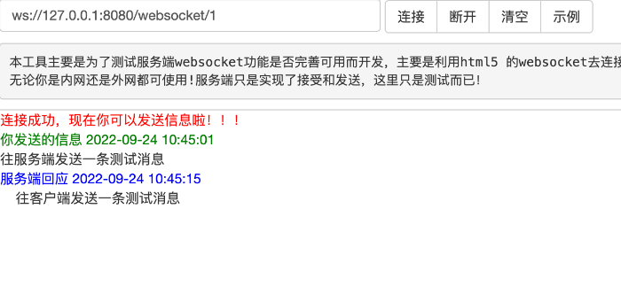
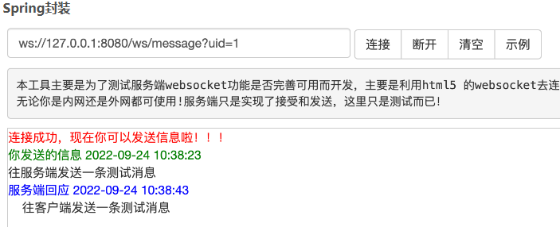

# Spring Boot实现WebSocket实时通信

本文将详细介绍如何在Spring Boot应用程序中实现WebSocket实时通信。

探讨WebSocket的基本概念，以及如何使用Spring Boot和Spring WebSocket模块来实现WebSocket服务器和客户端。

通过具体的示例来展示如何在Spring Boot应用程序中配置和使用WebSocket，以及如何实现实时消息传递和群发消息等功能。

# 一、WebSocket的基本概念

1. 什么是WebSocket？
WebSocket是一种网络通信协议，它提供了一种全双工通信渠道，允许服务器和客户端之间进行实时数据交换。WebSocket协议基于TCP协议，通过WebSocket连接，服务器和客户端可以相互发送消息，实现实时通信。
2. WebSocket的特点

全双工通信：WebSocket协议支持服务器和客户端之间的全双工通信，客户端和服务器可以同时发送消息。

持久连接：WebSocket连接一旦建立，将持续保持打开状态，直到客户端或服务器关闭连接。

跨域通信：WebSocket协议支持跨域通信，允许不同域的服务器与客户端建立连接。
# 二、在Spring Boot中实现WebSocket实时通信

## 原生注解

### 引入依赖

```
<dependencies>
    </dependency>
    <!-- Spring Boot WebSocket依赖 -->
    <dependency>  
    <groupId>org.springframework.boot</groupId>
	<artifactId>spring-boot-starter-websocket</artifactId>
    </dependency>
</dependencies>
```

### 配置文件

```
@Component
public class WebSocketConfig {
	/**
     * 	注入ServerEndpointExporter，
     * 	这个bean会自动注册使用了@ServerEndpoint注解声明的Websocket endpoint
     */
    @Bean
    public ServerEndpointExporter serverEndpointExporter() {
        return new ServerEndpointExporter();
    }
}
```

### 处理消息

```java
package com.armour.brsign.useragent.service;

import lombok.extern.slf4j.Slf4j;
import org.springframework.stereotype.Component;

import javax.websocket.*;
import javax.websocket.server.PathParam;
import javax.websocket.server.ServerEndpoint;
import java.util.concurrent.ConcurrentHashMap;
import java.util.concurrent.CopyOnWriteArraySet;

@Component
@ServerEndpoint("/webSocket/{userId}")
@Slf4j
public class WebSocket {

    private Session session;

    private String userId;
	 /**
     * 线程安全的无序的集合
     */
    private static CopyOnWriteArraySet<WebSocket> webSocketSet = new CopyOnWriteArraySet<>();
    /**
     * 存储在线连接数
     */
    private static ConcurrentHashMap<String, Session> sessionPool = new ConcurrentHashMap<String, Session>();

    @OnOpen
    public void onOpen(Session session, @PathParam(value = "userId") String userId) {
        try {
            this.session = session;
            webSocketSet.add(this);
            this.userId = userId;
            sessionPool.put(userId, session);
            log.info("【websocket消息】有新的连接{}, 总数:{}", userId, webSocketSet.size());
        } catch (Exception e) {
            throw new RuntimeException(e);
        }
    }

    @OnClose
    public void onClose() {
        try {
            webSocketSet.remove(this);
            sessionPool.remove(this.userId);
            log.info("【websocket消息】连接断开, 总数:{}", webSocketSet.size());
        } catch (Exception e) {
            throw new RuntimeException(e);
        }
    }

    @OnMessage
    public void onMessage(String message) {
        log.info("【websocket消息】收到客户端发来的消息:{}", message);
    }

    @OnError
    public void onError(Session session, Throwable error) {
        log.error("用户错误,原因:" + error.getMessage());
        error.printStackTrace();
    }
    
    

    /**
     * 此为单点消息
     */
    public void sendOneMessage(String userId, String message) {
        Session session = sessionPool.get(userId);
        if (session != null && session.isOpen()) {
            try {
                log.info("【websocket消息】 userId:{},单点消息:{}", userId, message);
                session.getAsyncRemote().sendText(message);
            } catch (Exception e) {
                e.printStackTrace();
            }
        }
    }
	/**
     * 此为广播消息
     *
     * @param message 消息
     */
    public void sendMessage(String message) {
        log.info("【websocket消息】广播消息, message={}", message);
        for (WebSocket webSocket : webSocketSet) {
            try {
                if (webSocket.session.isOpen()) {
                    webSocket.session.getAsyncRemote().sendText(message);
                }
            } catch (Exception e) {
                e.printStackTrace();
            }
        }
    }
    
     /**
     * 此为单点消息(多人)
     *
     * @param userIds 用户编号列表
     * @param message 消息
     */
    public void sendMoreMessage(String[] userIds, String message) {
        for (String userId : userIds) {
            Session session = SESSION_POOL.get(userId);
            if (session != null && session.isOpen()) {
                try {
                    log.info("【WebSocket消息】单点消息：" + message);
                    session.getAsyncRemote().sendText(message);
                } catch (Exception e) {
                    e.printStackTrace();
                }
            }
        }
    }

}


@ServerEndpoint：将目前的类定义成一个websocket服务器端，注解的值将被用于监听用户连接的终端访问URL地址，客户端可以通过这个URL来连接到WebSocket服务器端
@OnOpen：当WebSocket建立连接成功后会触发这个注解修饰的方法。
@OnClose：当WebSocket建立的连接断开后会触发这个注解修饰的方法。
@OnMessage：当客户端发送消息到服务端时，会触发这个注解修改的方法。
@OnError：当WebSocket建立连接时出现异常会触发这个注解修饰的方法。

```

```

@Resource
WebSocket webSocket;

webSocket.sendOneMessage(faDistributionLogReqparam.getSessionId(),"文件下载完成");
```

## Spring封装
### 引入依赖

```
<dependency>
   <groupId>org.springframework.boot</groupId>
   <artifactId>spring-boot-starter-websocket</artifactId>
</dependency>
```

### 自定义处理器
处理器作用类似于@RequestMapping注解，用于处理某一个路径的WebSocket连接，自定义处理器需要实现WebSocketHandler接口。

### WebSocket操作类
```
public interface WebSocket {
    /**
     * 会话开始回调
     *
     * @param session 会话
     */
    void handleOpen(WebSocketSession session);

    /**
     * 会话结束回调
     *
     * @param session 会话
     */
    void handleClose(WebSocketSession session);

    /**
     * 处理消息
     *
     * @param session 会话
     * @param message 接收的消息
     */
    void handleMessage(WebSocketSession session, String message);

    /**
     * 发送消息
     *
     * @param session 当前会话
     * @param message 要发送的消息
     * @throws IOException 发送io异常
     */
    void sendMessage(WebSocketSession session, String message) throws IOException;

    /**
     * 发送消息
     *
     * @param userId  用户id
     * @param message 要发送的消息
     * @throws IOException 发送io异常
     */
    void sendMessage(String userId, TextMessage message) throws IOException;

    /**
     * 发送消息
     *
     * @param userId  用户id
     * @param message 要发送的消息
     * @throws IOException 发送io异常
     */
    void sendMessage(String userId, String message) throws IOException;

    /**
     * 发送消息
     *
     * @param session 当前会话
     * @param message 要发送的消息
     * @throws IOException 发送io异常
     */
    void sendMessage(WebSocketSession session, TextMessage message) throws IOException;

    /**
     * 广播
     *
     * @param message 字符串消息
     * @throws IOException 异常
     */
    void broadCast(String message) throws IOException;

    /**
     * 广播
     *
     * @param message 文本消息
     * @throws IOException 异常
     */
    void broadCast(TextMessage message) throws IOException;

    /**
     * 处理会话异常
     *
     * @param session 会话
     * @param error   异常
     */
    void handleError(WebSocketSession session, Throwable error);

    /**
     * 获得所有的 websocket 会话
     *
     * @return 所有 websocket 会话
     */
    Set<WebSocketSession> getSessions();

    /**
     * 得到当前连接数
     *
     * @return 连接数
     */
    int getConnectionCount();
}

```

### WebSocket操作实现类
```
@Slf4j
public class WebSocketImpl implements WebSocket {
    /**
     * 在线连接数（线程安全）
     */
    private final AtomicInteger connectionCount = new AtomicInteger(0);

    /**
     * 线程安全的无序集合（存储会话）
     */
    private final CopyOnWriteArraySet<WebSocketSession> sessions = new CopyOnWriteArraySet<>();

    @Override
    public void handleOpen(WebSocketSession session) {
        sessions.add(session);
        int count = connectionCount.incrementAndGet();
        log.info("a new connection opened，current online count：{}", count);
    }

    @Override
    public void handleClose(WebSocketSession session) {
        sessions.remove(session);
        int count = connectionCount.decrementAndGet();
        log.info("a new connection closed，current online count：{}", count);
    }

    @Override
    public void handleMessage(WebSocketSession session, String message) {
        // 只处理前端传来的文本消息，并且直接丢弃了客户端传来的消息
        log.info("received a message：{}", message);
    }

    @Override
    public void sendMessage(WebSocketSession session, String message) throws IOException {
        this.sendMessage(session, new TextMessage(message));
    }

    @Override
    public void sendMessage(String userId, TextMessage message) throws IOException {
        Optional<WebSocketSession> userSession = sessions.stream().filter(session -> {
            if (!session.isOpen()) {
                return false;
            }
            Map<String, Object> attributes = session.getAttributes();
            if (!attributes.containsKey("uid") {
                return false;
            }
            String uid = (String) attributes.get("uid");
            return uid.equals(userId);
        }).findFirst();
        if (userSession.isPresent()) {
            userSession.get().sendMessage(message);
        }
    }

    @Override
    public void sendMessage(String userId, String message) throws IOException {
        this.sendMessage(userId, new TextMessage(message));
    }

    @Override
    public void sendMessage(WebSocketSession session, TextMessage message) throws IOException {
        session.sendMessage(message);
    }

    @Override
    public void broadCast(String message) throws IOException {
        for (WebSocketSession session : sessions) {
            if (!session.isOpen()) {
                continue;
            }
            this.sendMessage(session, message);
        }
    }

    @Override
    public void broadCast(TextMessage message) throws IOException {
        for (WebSocketSession session : sessions) {
            if (!session.isOpen()) {
                continue;
            }
            session.sendMessage(message);
        }
    }

    @Override
    public void handleError(WebSocketSession session, Throwable error) {
        log.error("websocket error：{}，session id：{}", error.getMessage(), session.getId());
        log.error("", error);
    }

    @Override
    public Set<WebSocketSession> getSessions() {
        return sessions;
    }

    @Override
    public int getConnectionCount() {
        return connectionCount.get();
    }
}

```

### 自定义WebSocket处理器

```
public class DefaultWebSocketHandler implements WebSocketHandler {

    @Autowired
    private WebSocket webSocket;

    /**
     * 建立连接
     *
     * @param session Session
     */
    @Override
    public void afterConnectionEstablished(@NonNull WebSocketSession session) {
        webSocket.handleOpen(session);
    }

    /**
     * 接收消息
     *
     * @param session Session
     * @param message 消息
     */
    @Override
    public void handleMessage(@NonNull WebSocketSession session, @NonNull WebSocketMessage<?> message) {
        if (message instanceof TextMessage) {
            TextMessage textMessage = (TextMessage) message;
            webSocket.handleMessage(session, textMessage.getPayload());
        }
    }

    /**
     * 发生错误
     *
     * @param session   Session
     * @param exception 异常
     */
    @Override
    public void handleTransportError(WebSocketSession session, Throwable exception) {
        webSocket.handleError(session, exception);
    }

    /**
     * 关闭连接
     *
     * @param session     Session
     * @param closeStatus 关闭状态
     */
    @Override
    public void afterConnectionClosed(@NonNull WebSocketSession session, @NonNull CloseStatus closeStatus) {
        webSocket.handleClose(session);
    }

    /**
     * 是否支持发送部分消息
     *
     * @return false
     */
    @Override
    public boolean supportsPartialMessages() {
        return false;
    }
}

```


### 自定义拦截器
自定义处理器需要实现HandshakeInterceptor接口

```
public class WebSocketInterceptor implements HandshakeInterceptor {

    @Override
    public boolean beforeHandshake(@NonNull ServerHttpRequest request, @NonNull ServerHttpResponse response, @NonNull WebSocketHandler wsHandler, @NonNull Map<String, Object> attributes) throws Exception {
        if (request instanceof ServletServerHttpRequest) {
            ServletServerHttpRequest servletServerHttpRequest = (ServletServerHttpRequest) request;
            // 模拟用户（通常利用JWT令牌解析用户信息）
            String userId = servletServerHttpRequest.getServletRequest().getParameter("uid");
            // TODO 判断用户是否存在
            attributes.put("uid", userId);
            return true;
        }
        return false;
    }

    @Override
    public void afterHandshake(@NonNull ServerHttpRequest request, @NonNull ServerHttpResponse response, @NonNull WebSocketHandler wsHandler, Exception exception) {

    }
}

```

WebSocket 无法使用 header 传递参数，因此这里使用 url params 携带参数。

### WebSocket配置项
将自定义处理器、拦截器以及WebSocket操作类依次注入到IOC容器中。

```
@Configuration
@EnableWebSocket
public class WebSocketConfiguration implements WebSocketConfigurer {

    @Bean
    public DefaultWebSocketHandler defaultWebSocketHandler() {
        return new DefaultWebSocketHandler();
    }

    @Bean
    public WebSocket webSocket() {
        return new WebSocketImpl();
    }

    @Bean
    public WebSocketInterceptor webSocketInterceptor() {
        return new WebSocketInterceptor();
    }

    @Override
    public void registerWebSocketHandlers(@NonNull WebSocketHandlerRegistry registry) {
        registry.addHandler(defaultWebSocketHandler(), "ws/message")
                    .addInterceptors(webSocketInterceptor())
                    .setAllowedOrigins("*");
    }
}

```

- @EnableWebSocket：开启WebSocket功能
- addHandler：添加处理器
- addInterceptors：添加拦截器
- setAllowedOrigins：设置允许跨域（允许所有请求来源）

### WebSocket测试

原生注解



Spring封装



测试:http://devtest.run/websocket.html