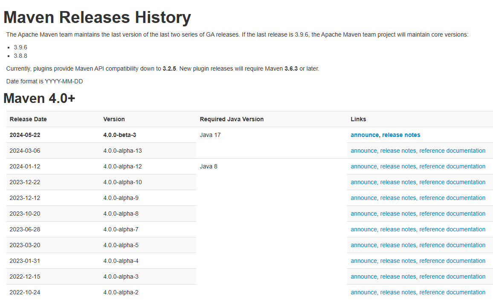

# 项目install的时候报错“module jdk.compiler does not “opens com.sun.tools.javac.processing“ to unnamed modul

在网上查资料发现是maven版本与jdk版本不一致导致的。

解决方式(windows)：

1.mvn -version  查看本地的maven版本

   java -version 查看本地的jdk版本

2.点击 http://maven.apache.org/docs/history.html

  查看maven与jdk版本对应关系

3、maven 下载地址：[Maven – Download Apache Maven](https://maven.apache.org/download.cgi)
